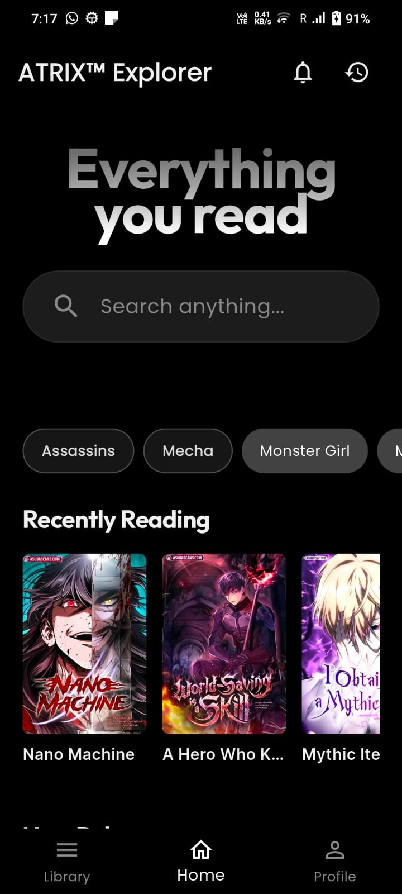

# Atrix Explorer

A browser designed for readers.

Atrix Explorer helps readers focus on what matters most: reading.

Built with powerful reading-focused tools, intelligent library management, reading insights, content organization, and automation that removes the friction from tracking and managing your reading journey.

## Features

* Reading-focused browsing experience
* Automated library management
* Reading progress tracking
* Personalized reading insights
* Advanced content filtering
* Manga and web novel library support
* Fast and optimized performance
* Privacy-conscious design

## Download

# Atrix Explorer

[⬇ Download Latest APK](../../releases/latest)
Download the latest Android APK from the Releases section.

## Screenshots

## Screenshots

  
  
  

  
  
   

## Release Notes

Every release includes detailed information about new features, improvements, bug fixes, and performance updates.

## Feedback

We welcome feedback and feature suggestions from the community.

## Disclaimer

Atrix Explorer does not host or distribute copyrighted reading content. Users are responsible for complying with applicable laws and the terms of services of websites they access.

